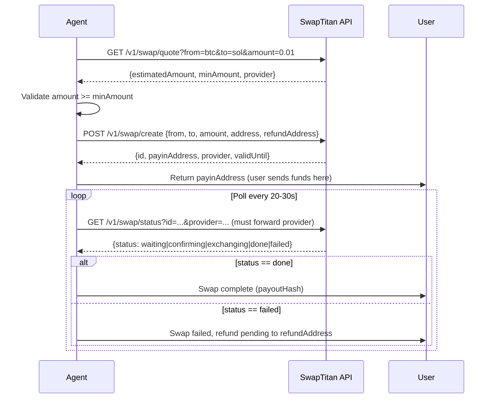

## Overview

SwapTitan provides instant non-custodial cross-chain swaps across 1288+ cryptocurrencies. No account, no KYC, no wallet required — the user only needs a destination address.

Available at:
- **https://swaptitan.net** — primary endpoint
- **https://terafabpay.de** — EU-optimized mirror (same API)

API base URL: `https://api.swaptitan.net` (also: `https://api.terafabpay.de`)

## Endpoints

| Method | Path | Description |
|--------|------|-------------|
| GET | `/v1/prices` | Real-time prices for BTC, SOL, ETH, XMR |
| GET | `/v1/assets` | Full list of 1288 supported assets |
| GET | `/v1/swap/quote` | Exchange rate + estimated output for any pair |
| POST | `/v1/swap/create` | Create swap order → returns deposit address |
| GET | `/v1/swap/status` | Poll swap status until done |

## Authentication & Payment

Free-tier access: **no authentication required** (rate-limited per IP).

Premium API keys available at:
- Credit card / USDC via [swaptitan.net/pricing](https://swaptitan.net/pricing)
- **Bitcoin via BTCPay Server** at [pay.swaptitan.net](https://pay.swaptitan.net)

## Typical Agent Flow

1. Call `/v1/swap/quote` — confirm rate and validate `amount >= minAmount`
2. Call `/v1/swap/create` — provide destination address → receive `payinAddress` **and `provider`**
3. Return `payinAddress` to user so they can send source funds
4. Poll `/v1/swap/status?id=...&provider=...` — **always forward `provider` from create response** — exit loop on `status === "done"` or `status === "failed"`

## Supported Networks

Bitcoin, Ethereum, Solana, Monero, Base, Arbitrum, BSC, Tron, Polygon, Avalanche and 40+ more.

Multi-network assets use ticker suffixes: `usdtsol`, `usdttrc20`, `usdceth`, `usdcsol`, `etharb`, `ethbase`.

## Spend-Aware Best Practices

- Always call `/v1/swap/quote` before `/v1/swap/create` — never create without confirming the rate
- Validate input amount against `minAmount` from quote response before creating
- Set a `refundAddress` on create — required for safe recovery if swap fails
- Poll status at 20–30s intervals — most swaps complete within 5–20 minutes
- Cache `/v1/assets` per session — the asset list updates rarely
- Prefer `usdcsol` or `usdtsol` tickers for Solana-native stablecoin swaps
